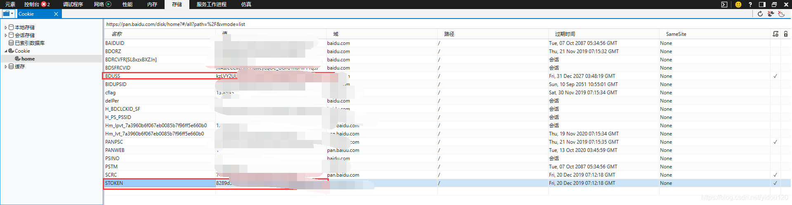

## 🚀 Usage

1. **Clone the repository**

   ```bash
   git clone https://github.com/SanMumumu/BDY-GO.git
   cd BDY-GO
   ./BaiduPCS-Go
   ```

2. **Login to Baidu Cloud**
   You need to provide your `BDUSS` token (retrieve it from the Baidu Cloud web interface as described [here](https://blog.csdn.net/yidou120/article/details/103163852)):

   ```bash
   login --bduss=xxxxx
   ```
    
3. **Basic Commands**

* **List directory contents**:

    ```bash
    ls
    ```
* **Upload files or directories**:

    ```bash
    upload <local_file_path> <remote_path>
    ```
* **Download files or directories**:

    ```bash
    download <remote_path> --saveto <local_path>
     ```
